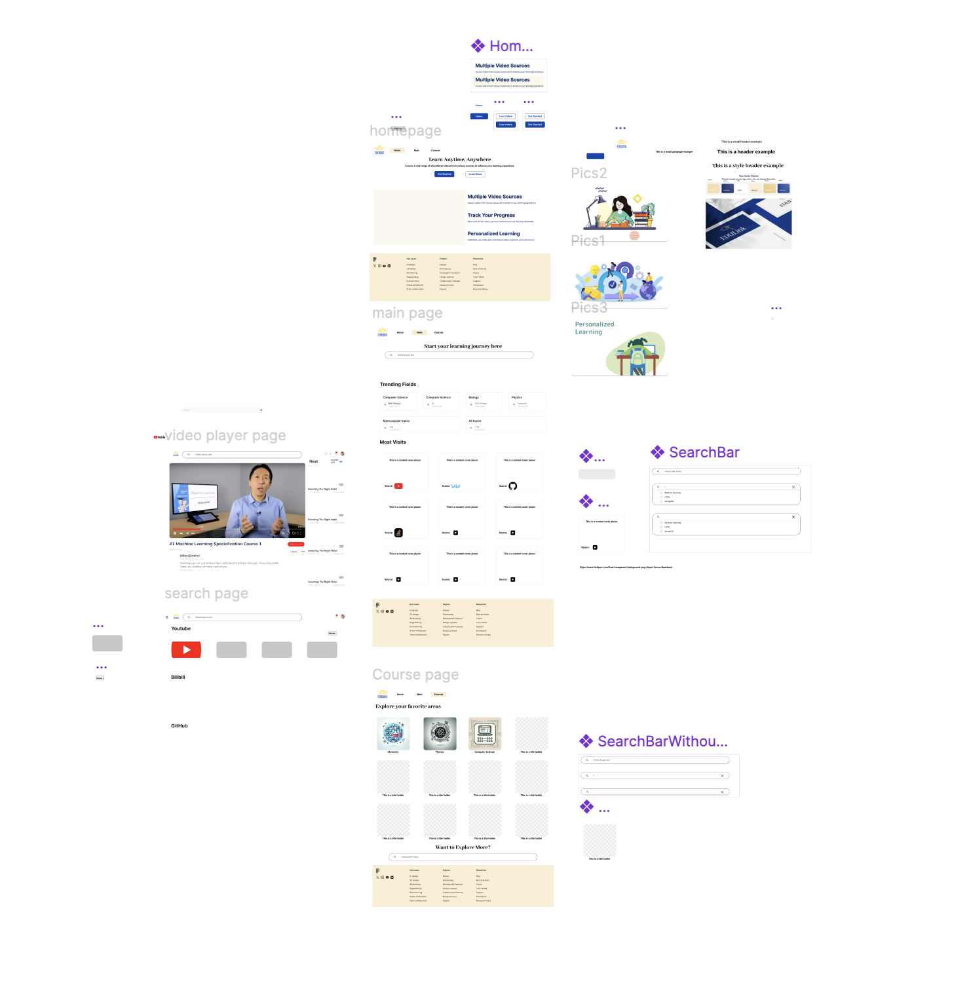

[](https://classroom.github.com/a/eD9oPTLm)

# **EDULink: A centralised adaptive learning platform**

<details>
<summary><b>Table of Contents</b></summary>

- [General](#general)
  - [1. Relevance of Problem Statement](#1-relevance-of-problem-statement)
  - [2. Solution Architecture](#2-solution-architecture)
  - [3. Legal/Other Aspects](#3-legalother-aspects)
  - [4. Competition Analysis](#4-competition-analysis)
- [Features](#features)
  - [1. Centralised Learning Hub](#1-centralised-learning-hub)
  - [2. User-Friendly Login and History Tracking](#2-user-friendly-login-and-history-tracking)
  - [3. AI-Powered Search with Relevance Filtering](#3-ai-powered-search-with-relevance-filtering)
  - [4. AI Assistant Integration on the Player Page](#4-ai-assistant-integration-on-the-player-page)
- [Project Setup](#project-setup)
  - [1. Clone the Repository](#1-clone-the-repository)
  - [2. Install and Switch to NodeJS 16](#2-install-and-switch-to-nodejs-16)
  - [3. Install Dependencies](#3-install-dependencies)

</details>

	
## General:
### **1. Relevance of Problem Statement**

<details><summary><b>Click to expand Relevance of Problem Statement</b></summary>   
	
### **The Problem**
Modern learners face significant challenges in accessing and organizing educational content, which is often scattered across multiple platforms, such as:
- **YouTube**: Abundant video resources but unstructured content.
- **Bilibili**: Educational content mixed with entertainment, offer rich information for Chinese users
- **Academic Papers and Research Repositories** (e.g., ArXiv): Rich content but limited accessibility and interactivity.
- **GitHub and Coding Platforms**: Useful for practical learning but challenging to integrate with theoretical content.

Searching through these platforms one by one is **time-consuming** and risks:
- Missing critical information.
- Being distracted by unrelated content.
- Facing inefficiencies in managing diverse resources.

---

### **Key Requirements for a Solution**
To address these challenges, there is a pressing need for an **integrated, immersive self-study environment** that provides:
1. **Content Aggregation**: 
   - Collects resources from multiple sources in real-time.
   - Ensures relevance and quality in a centralized hub.
2. **Enhanced Search and Filtering**: 
   - Refines search results to prioritize relevance.
   - Improves the quality of study resources with AI-powered filtering.
3. **Interactive Features**: 
   - Includes chatbots, curated collections, and organized categories.
   - Enhances user engagement and learning outcomes.
4. **Unified User Accounts**:
   - Enables secure login.
   - Tracks study progress and provides personalized learning tools.

---

### **Implementation Complexity**
Implementing such a solution comes with several challenges, including:

- **Backend Development**:
  - Building a scalable backend to aggregate and process vast amounts of data.
  - Continuously integrating with various **APIs** for dynamic content updates.
  
- **AI Integration**:
  - Leveraging AI technologies for **adaptive recommendations** that evolve based on user behavior.
  - Ensuring personalized and context-aware suggestions for diverse learning needs.

- **User-Friendly Front End**:
  - Designing an intuitive interface with advanced filtering, search, and interactive tools.
  - Catering to users of all technical expertise levels.

- **Cross-Device Synchronization**:
  - Ensuring seamless accessibility across devices.
  - Allowing users to maintain progress and retrieve learning materials anytime, anywhere.

---

### **Future Relevance (2/5/10 Years)**

The demand for centralized learning platforms will grow as the **proliferation of online educational content accelerates**. EDULink positions itself as a sustainable solution by focusing on:
1. **Continuous Integration**:
   - Adding relevant resources from emerging platforms.
   - Keeping the platform fresh and comprehensive.

2. **AI-Driven Personalization**:
   - Refining domain-specific recommendation algorithms.
   - Delivering tailored learning experiences to meet evolving user goals.

3. **Cutting-Edge Features**:
   - Incorporating technologies like **AI-powered tutoring** and **real-time feedback tools**.
   - Enhancing engagement and productivity for users.

---
### **Competitive Edge**
By focusing on **accessibility**, **adaptability**, and **personalization**, EDULink ensures its relevance and competitiveness in an ever-evolving educational landscape.

</details>

### **2. Solution Architecture**
<details><summary><b>click to expand Solution Architecture</b></summary>

### **Overview**

The project is an educational web application designed to offer students interactive tools for learning, such as categorized study materials, video resources, and filtering/search features. It is modularly structured, promoting maintainability and scalability. This architecture outlines the page flow, component functionality, and key modules.

---

### **Figma Design**


---
  
### **Information Architecture**
  
The application is divided into three layers:
1. Presentation Layer (Frontend):
	- Built using React.js to provide a responsive and interactive user experience.
	- Modular components are used to build pages dynamically and efficiently.
2. Application Logic Layer:
	- Handles the state management, routing, and business logic using React states/hooks or a state management library like Redux.
3. Data Layer:
	- Backend API integration to fetch study materials, videos, and other content (e.g., course data, search results).
	- Utilizes Proxy and GraphQL APIs for communication.

---

### **Page Structure**
1. Homepage:
    - Components: Navibar, Footer.
    - Purpose: Acts as the landing page with introduction of website.

2.	CoursePage:
	-	Components: Navibar, Footer, CourseCard, SearchResultDisplay.
	-	Purpose: Displays categorized courses with filtering options.

3. MainPage:
    - Components: Navibar, Footer, TrendingFields, PlayGrid, ResourceFilter, SearchResultDisplay, CollectionStar.
    - Purpose: Highlights “Trending Fields” and “Most Visited” content, allowing users to filter resources based on their selected preferences and add specific resources to their collection as needed.

4. VideoPlayerPage:
	-	Components: Navibar, Footer, Collectionstar, PlayList, VideoPlayerAssistant, SearchResultDisplay.
	- Purpose: Showcases video resources with added features such as a chatbot, personalized collections, and recommended playlists.

5. SearchPage:
	-	Components: Navibar, Footer, SearchResultsList, ResourceFilter.
	-	Purpose: Provides search functionality with filtering and sorting features for relevant materials.

6.	HistoryPage/CollectionPage:
	-	Components: Navibar, Footer.
	-	Purpose: Keeps a record of the user’s progress, recently accessed materials, or personal collections.

---

### **Modular Architecture**
1. Pages:
Each page (e.g., Homepage, SearchPage) uses a combination of modular components to ensure reusability.
2. Styling: Each component or page has a corresponding .module.css file to enable scoped styling.
3. State Management: Use Context API for managing shared state (e.g., search results, user preferences).
4. Routing: Utilize React Router for navigation between pages like /home, /courses, /search etc..
</details>

### **3. Legal/Other Aspects**
<details><summary><b>click to expand Legal/Other Aspects</b></summary>

### **Open Source Usage**
- The platform relies on open-source libraries and frameworks for APIs, UI components, and web development frameworks (e.g., React, Node.js).
- Third-party integrations (e.g., YouTube, Bilibili, ArXiv, GitHub) are implemented in compliance with their respective terms of service and usage policies, ensuring proper attribution and adherence to licensing requirements.
- Regular audits are conducted to ensure updates in third-party API terms are reflected in the platform's usage.
- Open-source contributions to improve the platform’s features are encouraged and managed through a transparent licensing model, such as MIT or Apache 2.0, to foster community engagement.
---


### **Protecting Against Copying**
- **Proprietary Features:** The AI-based recommendation engine, personalized learning algorithms, and interactive tools are proprietary and can be safeguarded through patents to ensure originality and competitive advantage.
- **Branding:** The platform’s logo, color scheme, and other distinctive elements can be trademarked to protect the brand identity from imitation.
- **UI/UX Design:** The user interface and unique content organization strategies can be copyrighted to secure intellectual property rights.
- **Digital Watermarking:** Educational resources, especially AI-generated materials, can be embedded with digital watermarks to trace unauthorized replication or redistribution.
- **Data Encryption:** User data, particularly progress and preferences, is encrypted to prevent breaches and unauthorized access.

---

### **Compliance with Legal Standards**
- The platform adheres to global data privacy laws, such as the General Data Protection Regulation (GDPR) in the EU and the Personal Data Protection Act (PDPA) in Singapore.
- Content sourced from third-party platforms ensures respect for intellectual property rights, and takedown mechanisms are implemented to address disputes promptly.
- All user-generated content, such as notes or collections, is protected by platform-specific policies, ensuring both user ownership and platform moderation for compliance.


</details>

### **4. Competition Analysis**
<details><summary><b>Click to expand Competition Analysis</b></summary>

### **Competitors**
  
1. **Khan Academy**
   - **Strengths:** Comprehensive free courses, interactive exercises, and a well-organized learning structure.
   - **Weaknesses:** Limited aggregation of third-party content and less focus on advanced or professional-level topics.

2. **Coursera/edX**
   - **Strengths:** Offers university-level courses, industry-recognized certifications, and collaborations with top institutions.
   - **Weaknesses:** High cost for certifications and limited free content. Lack of real-time personalized recommendations or integration with diverse learning formats.

3. **YouTube**
   - **Strengths:** Free access to a vast repository of educational videos on a wide range of topics.
   - **Weaknesses:** Content is often unstructured, lacks categorization for educational purposes, and includes distractions from entertainment-focused content.

4. **ArXiv**
   - **Strengths:** Extensive library of academic and research papers, particularly in STEM fields.
   - **Weaknesses:** No interactive tools, minimal user interface enhancements, and limited accessibility for non-academic users.

---

### **How EDULink Stands Out**
  
- **Centralized Platform:** Integrates videos, articles, and research papers from multiple sources, providing users with a unified hub for diverse educational content.
- **AI-Driven Personalization:** Delivers adaptive learning through AI-powered recommendations tailored to user goals, behavior, and preferences.
- **Interactivity:** Offers features like chatbots, history/collection track to improve engagement and learning efficiency.
- **Scalability and Accessibility:** Designed to handle diverse and growing educational content while ensuring relevance for students, professionals, and lifelong learners.

---

### **Target Audience**
Our primary users include **students, professionals, and lifelong learners** who value:
- Access to educational content from **multiple sources in one place**.
- Enhanced learning tools, such as categorization, adaptive pathways, and personal collections.
- Support for self-paced study with interactive features that simplify learning.

By addressing gaps in existing platforms and focusing on user-centric innovations, EDULink positions itself as a comprehensive solution for modern learners.

</details>


## 1. Novel Features
### **1. Front-end Feature**
<details>
<summary><b>click to expand Front-end Feature</b></summary>

### 2. Core Features
- **Multi-page Application with React Router**:
  - Designed and implemented **7 pages** that mentioned in [Page Structure](#4-page-structure) above to handle different user interactions and present information dynamically:
  - Utilized **React Router** for seamless navigation across pages.

- **TailwindCSS Integration**:
  - Leveraged **TailwindCSS** for building responsive and modern UI components with a consistent design language.
  - Incorporated **Flowbite components** to enhance usability and aesthetics.

- **Reusable Components**:
  - **Header (NavBar)**:
    - Displays the logo, navigation buttons, and a Google login button.
    - Post-login, shows the user's avatar and name with a dropdown menu for account management, history, and collection redirection.
  - **Footer**:
    - Redirects users to different informational sections based on parameters added to the URL.
  - **Search Bar**:
    - Features dynamic search with real-time suggestions based on user input.
    - Provides exact matches and handles diverse search queries efficiently.

- **Responsive Video Player Page**:
  - Developed a **unified VideoPlayerPage** to play videos from different sources (YouTube, Bilibili, etc.).
  - Includes interactive features:
    - **Collection Star** for bookmarking videos.
    - A responsive chatbot assistant for real-time queries during video playback.
    - Recommended playlists based on video context.

---

### 3. Enhanced User Experience
- **Interactive Features**:
  - **Google Login Integration**:
    - Enables user account management with avatar, name and emailaddress displayed upon login.
    - Dropdown menu for accessing history, collections and log out.
  - **Dynamic PlayGrid**:
    - Displays resource cards dynamically, showing cover images, source logos, titles and descriptions fetched from APIs.
  - **Trending Field Cards**:
    - Utilizes AI to display trending fields of a subject.
    - Presents these as clickable cards for deeper exploration of specific topics.

- **Advanced Search & Filters**:
  - **Search Bar** dynamically provides relevant suggestions as users type.
  - **Filter Component**:
    - Located under the search bar, allows users to refine results by restricting them to specific sources.
  - **Pagination Component**:
    - Available on the search page to load additional results when required.

- **Collection Management**:
  - **Collection Star Component**:
    - Located on the top-right corner of resource cards.
    - Toggle functionality to add/remove resources from collections dynamically.
    - Updates in real-time based on the user's interaction.

- **AI-Powered Chatbot**:
  - Integrated an external chatbot library.
  - Allows users to ask questions and get AI-powered responses while interacting with the platform, especially while watching videos.

---

### 4. UI & UX Enhancements
- **Consistent Styling**:
  - Followed a unified color scheme, font styles, and spacing for a cohesive user experience.
  - Scoped styles with **module.css** to maintain component-specific CSS without affecting the overall design.
  
- **Interactive Components**:
  - Buttons, icons, and dropdowns are designed for intuitive use.
  - Hover and focus states enhance interactivity.

- **Navigation & Usability**:
  - All links and buttons are functional, with no broken URLs.
  - Form validations are implemented where applicable.

---

### 5. Novel Features
- **Trending Field Cards**:
  - AI-driven content highlights popular topics dynamically, engaging users with relevant trends.
- **Filtered Search Results**:
  - Dynamically suggests relevant search results as users type into the search bar.
  - Leverages AI algorithms to predict and display the most likely matches in real-time, enhancing search efficiency and user experience.
- **VideoPlayer Assistant**:
  - A real-time chatbot assistant integrated into the video player to provide immediate help.
- **Dynamic API Integration**:
  - Cards in PlayGrid and search suggestions are dynamically updated based on backend API responses.

---

### 6. Future-Proof Features
- Modular structure ensures scalability and ease of adding new features or pages.
- AI-powered personalization supports evolving user needs.
- Responsive design ensures usability across devices and screen sizes.
</details>

### **2. Back-end Feature**
<details>
<summary><b>click to expand Back-end Feature</b></summary>

### 1. Integration with Multiple APIs
- **Supported APIs**:
  - **YouTube**: Fetches video metadata, related videos, and recommendations.
  - **Bilibili**: Retrieves video metadata, high-resolution thumbnails, and tags using session cookies.
  - **arXiv**: Searches and retrieves research paper metadata.
  - **GitHub**: Fetches repository metadata such as stars, description, and language.
- **Unified Response Structure**:
  - Combines diverse API responses into a consistent schema with properties like `id`, `title`, `description`, `image`, and `source`.

---

## 2. Performance Optimizations
- **Caching with NodeCache**:
  - Caches API responses for 5 minutes (`stdTTL: 300`) to reduce redundant calls and improve performance.
- **Parallel Processing**:
  - Utilizes `Promise.all` to handle multiple API requests and data parsing concurrently, minimizing latency.
- **Batch Processing for GPT Efficiency**:
  - Handles OpenAI API rate limits by dividing data into batches (`BATCH_SIZE: 10`) for parallel processing.

---

## 3. AI-Enhanced Content Filtering
- **Relevance Scoring with OpenAI GPT**:
  - Dynamically scores videos and other content based on relevance.
  - Filters out low-relevance results and sorts them in descending order of relevance.
- **Custom GPT Prompting**:
  - GPT prompts are dynamically generated based on the query and data to improve accuracy of relevance scores.

---

## 4. User Authentication
- **Google API Integration**:
  - Supports user authentication via Google.
  - Maintains user sessions across the website.
- **GraphQL Integration**:
  - Provides a schema-based API for authentication and user management.

---

## 5. Advanced Data Handling
- **HTML Sanitization**:
  - Removes unwanted HTML tags from titles and descriptions to ensure clean and safe content display.
- **Image Conversion to Base64**:
  - Encodes images (e.g., video thumbnails) in Base64 for seamless transmission, ensuring consistency even with external image hosting failures.

---

## 6. Flexible Query Parameters
- Supports dynamic query parameters (`keyword`, `videoid`, `source`, `page`) to:
  - Fetch content based on user input.
  - Retrieve related videos from YouTube and Bilibili.

---

## 7. Enhanced Pagination
- Handles pagination for all supported sources:
  - **arXiv**: Supports start index for incremental fetching.
  - **GitHub**: Supports paginated results with customizable page sizes.

---

## 8. Environment Variable Management
- **Secure Key Management**:
  - API keys (e.g., RapidAPI, Bilibili, OpenAI, GitHub) are securely stored in `.env` files using `dotenv`.

---

## 9. Proxy Server for CORS Handling
- **Centralized Proxy Server**:
  - Handles incoming requests and resolves CORS issues for external API calls.
- **Dynamic Request Handling**:
  - Centralized processing for APIs like YouTube, Bilibili, arXiv, and GitHub.

---

## 10. MongoDB Integration
- **Database Features**:
  - Stores user data, collections, and history in MongoDB.
  - Provides seamless connections using `connectToDb`.
  - Optimized queries using MongoDB operations (`findOneAndUpdate`, `$push`, `$pull`).

---

## 11. GraphQL API with Apollo Server
- **Schema-Based Queries**:
  - Provides flexible and efficient client-server interactions with clearly defined queries (`Query`) and mutations (`Mutation`).
- **Supported GraphQL Operations**:
  - Query user video history and collections.
  - Add or remove videos from history and collections.
  - Clear video history or collections.

---

## 12. Error Handling
- **Robust Error Management**:
  - Comprehensive `try-catch` blocks to handle network issues, API limits, and other failures gracefully.

---

## 13. Novel Features
- **Dynamic Data Mapping**:
  - Combines results from diverse sources (arXiv, GitHub, YouTube, Bilibili) into a unified schema.
- **Detailed Bilibili Metadata**:
  - Enriches video data with additional properties like tags, author details, and high-resolution thumbnails.
- **Relevance-Enriched Sorting**:
  - Combines GPT-based scores and metadata to deliver the most relevant content.

---

## 14. Automation and Setup
- **Setup Scripts**:
  - The backend initializes automatically with `npm start`, setting up all dependencies, server, and services.
- **Environment Setup**:
  - `.env` configuration ensures sensitive credentials are loaded dynamically.
</details>

## **Project Setup**
### **1. Clone the repository**
```bash
git clone https://github.com/IT5007-2410/course-project-project-3.git
cd course-project-project-3
```

### **2. Install and Switch to NodeJS 16**
- (1) Firstly, please ensure you have installed <code><a href="https://nodejs.org/en/download/">nodejs</a></code>.
- (2) Secondly, we need to switch to NodeJS 16.0.0 or higher. You can run the following commands to download nvm (if you haven't):
    ```bash
    # install nvm
    curl -o- https://raw.githubusercontent.com/nvm-sh/nvm/v0.39.3/install.sh | bash
    source ~/.bashrc  # reload shell
    ```
- (3) Then, you can run the following commands to install and then switch to NodeJS 16.0.0:
    ```bash
    nvm install 16 # install Node.js latest LTS version
    nvm use 16 # switch to Node.js 16
    nvm alias default 16 # set Node.js 16 as default
    ```

### **3. Install Dependencies**
Run the following commands to install the dependencies, load mongoDB, and start the server:
```bash
npm install
systemctl start mongod
npm start
```
Then you could access the project at <code><a href="http://127.0.0.1:5173/">http://127.0.0.1:5173/</a></code>.

> [!NOTE]
> Explanation for different ports we use in this project:
> - 5173: The port for the frontend.
> - 3000: The port for the public API we integrated in the backend.
> - 8000: The port for the own graphql API we integrated in the backend.
